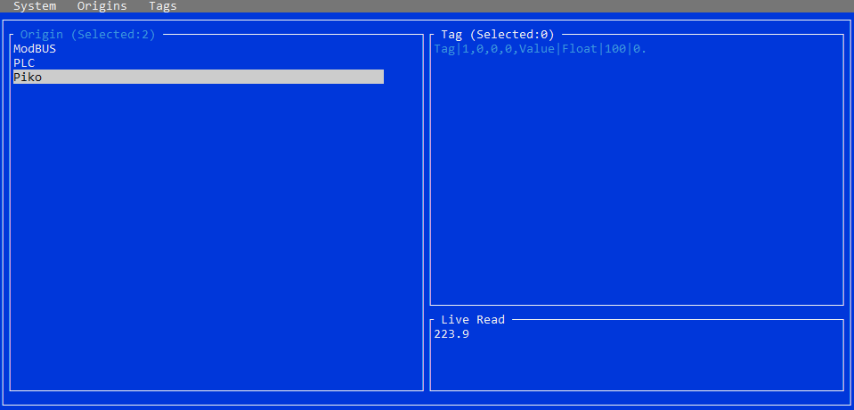

# Data Reader

A simple GUI for reading data from ModBus, AB Contrologix 5000 or XML, directly from the terminal.  
There is also a Worker Service that writes the required data (initialized by the GUI) to a local QuestDB.

## Libraries 

* https://github.com/zhaopeiym/IoTClient
* https://github.com/libplctag/libplctag.NET
* https://github.com/gui-cs/Terminal.Gui

## Authors

[@P923](https://www.github.com/P923)

